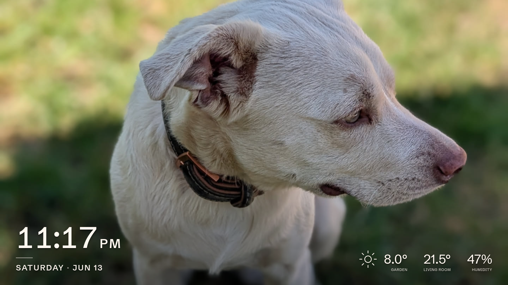

<div align="center">

# Picture Frame

**A self-hosted digital picture frame for the Raspberry Pi.**

Your photos beside the time, the weather, and the real temperature in your rooms. Motion-aware,
private, and plugged into Home Assistant.

[](https://pictureframe.ekemate.hu)
&nbsp;
[](#install)
&nbsp;
[](CONTRIBUTING.md)

<br>

[](https://github.com/MateEke/picture-frame/actions/workflows/ci.yml)
[](https://github.com/MateEke/picture-frame/releases/latest)
[](https://goreportcard.com/report/github.com/MateEke/picture-frame)
[](LICENSE)

</div>



It runs as a single static binary that serves both the on-screen kiosk display and a browser admin
interface, so you set everything up without re-flashing. It is light enough for a Raspberry Pi Zero
W driving an HD screen, and written in Go and Svelte.

## Highlights

- **Smooth crossfades:** fluid fade transitions between photos, even on hardware as modest as a
  Raspberry Pi Zero W driving an HD display.
- **Motion-aware screen power:** the panel blanks when the room is empty and wakes on motion. A
  manual on/off override persists across restarts.
- **Your photos, your way:** local uploads (cropped in the browser) or a synced
  [Immich](https://immich.app) album.
- **Two-way Home Assistant:** publishes sensor and screen state over MQTT with auto-discovery, and
  lets Home Assistant control the frame.
- **Live overlay:** a localized clock and date, weather (OpenWeatherMap), and live Bluetooth or
  MQTT sensor readings, captioned in your own words.
- **Built-in Wi-Fi management:** including a self-hosted access-point fallback with a captive portal
  when no known network is in range.
- **Local-first:** runs entirely on your LAN with no cloud account. The only things that reach the
  internet are the optional weather feed and clock sync. Add an RTC module and it runs fully
  offline, even air-gapped.
- **Highly customizable:** every option is set from the admin interface and saved to a TOML file.

## See it in action

https://github.com/user-attachments/assets/cee342a3-6438-43ce-9a11-cfcd60533817

## Documentation

The full documentation lives at **<https://pictureframe.ekemate.hu>**. It covers installation,
a guided tour of the admin interface, and every configuration option. For the engineering notes, see
[The story & the hard parts](https://pictureframe.ekemate.hu/development/story/).

## Install

On a fresh Raspberry Pi OS Trixie Lite, reachable over SSH:

```sh
curl -fsSL https://github.com/MateEke/picture-frame/releases/latest/download/install.sh | sudo bash
```

See the [Install guide](https://pictureframe.ekemate.hu/getting-started/install/) for the
requirements, options, and first setup.

## Development

```sh
make build   # builds the SvelteKit UI and the static ARM binary into dist/
```

See [`CONTRIBUTING.md`](CONTRIBUTING.md) for the development environment and the checks a change
needs to pass, and [`deploy/README.md`](deploy/README.md) for the system-level details behind an
install.

## License

[Apache 2.0](LICENSE).
