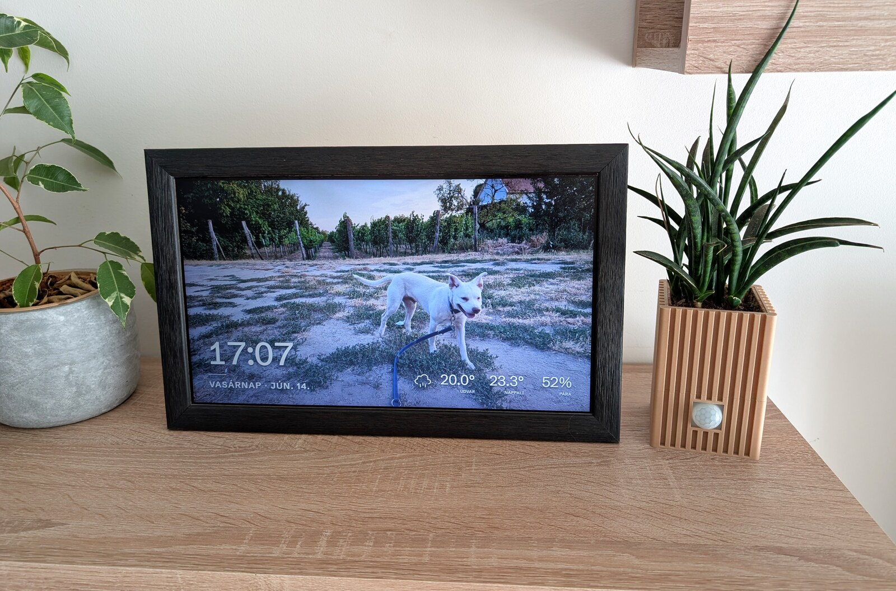

I built the first version in 2017. The Pi Zero W had just come out, and getting the whole thing to
run on something that small was the appeal, more a challenge I set myself than a hardware choice.

Back then it was three programs: a PyQt5 and QML kiosk on the Pi, a .NET Core server for uploads
and sensors, and an Angular web app for the interface. Room sensors over Bluetooth, motion
included, were part of the idea from the start, because IoT was the word of the day. A Home
Assistant link came later and made most of the .NET server redundant.

That is the frame as it sits today. The panel is a salvaged laptop screen, and the ribbed planter
next to it is 3D-printed, holding the sensors: an SHT21 for temperature and humidity, a cheap PIR
module for motion, and an nRF51822 to handle Bluetooth. Because it is wireless, that sensor pack
can sit anywhere in the room. In our last place it lived at the far end. Here it sits right next to
the frame, as in the photo. It is dated hardware, and I will keep it running until it stops. After that I will probably read my other sensors through Home Assistant
over MQTT instead. If I build a few more of these for family, I will likely swap the Bluetooth
board for an I2C sensor adapter.

## Why rewrite it

What pushed me to rebuild was the maintenance, not the features. The Pi client needed Qt
cross-compiled with the eglfs backend to run without a desktop, a fragile day-long build that was
very hard to reproduce after an SD card died. I kept image backups just to stay safe. I wanted
something I could rebuild from scratch without ceremony.

So this version is one program: a single Go binary with the admin interface, a SvelteKit app on
Svelte 5, built into it. No separate server, no Angular app, no database. The filesystem holds the
photos. Installing is a download, and an update replaces one file. The rest of this page is the
parts that took real work, and why they ended up looking the way they do.

## The crossfade

Qt with eglfs handled the photo crossfade easily. Moving it to a browser on this hardware did not.

A plain Svelte transition was the obvious starting point, and it was far too heavy for the Zero W.
Next I tried two image layers, swapping the hidden one and animating the opacity of both as they
loaded. It stuttered, but it was closer. Then I kept the two layers but animated opacity only on
the incoming image. In a proof of concept that ran well, so I built the rest on top of it.

It came apart once the overlay and the SSE listeners were in place. The fade-in stayed smooth, but
the fade-out had become a sudden blip. The fix was to never animate a fade-out at all. The fader
only ever fades the incoming image in over the current one. When that finishes, it copies the
now-visible image down to the base layer and snaps the top layer back to invisible without
animating. Every transition is a single fade-in, which is the one thing the Pi does smoothly.

## Turning the screen off

The old app powered the screen with `vcgencmd` and it was reliable, so the rewrite started there
too. On its own merits it is good: light on resources, the screen never wakes itself, and a
restart of the browser comes straight back at the right resolution. The catch was that the Pi
crashed every few days. I turned on persistent logging and went through `dmesg` and the rest, and
found no out-of-memory, no obvious cause.

On a hunch that it was the fake-KMS driver, I moved to full KMS, the modern path anyway, and it
has been stable since. That meant living with a compositor.

cog's default is the cage compositor, and it gave me three problems: you can hide the cursor only
with an invisible cursor theme, you cannot restart the browser without taking cage down with it,
and it has no `wlopm`, only `wlr-randr`. The middle one matters more than it sounds. A recoverable
crash or an overnight update would restart the browser, and with cage that lights the screen up at
2 a.m. while it is meant to be off. That is not acceptable for something sitting on a shelf.

labwc solved all three. It is a little heavier than cage, but the cursor hides from a config file,
it supports `wlopm`, and it survives a browser restart, so the screen's on-or-off state holds
across one.

That left two quirks. The screen would turn itself back on about a minute after going off: when
the panel sleeps it drops its hotplug signal, the driver reads that as unplugged, and the
compositor releases the output. Pinning the connector on the kernel command line, so the driver
always treats it as present, settles it, and the installer writes that line. The other: the
browser would come up at the wrong resolution if it restarted while the screen was off, because
labwc cannot size a window against a dark output. A small launch script reads the panel's mode
directly, which it still reports while off, and tells the browser its size up front.

This whole detour is why there are two display [backends](/manual/slideshow-display/). The full-KMS
path with labwc and `wlopm` is the default. The `vcgencmd` path is the legacy fallback. They set up
different system services and boot settings, so switching between them means re-running the
installer rather than changing a setting.

## Living within 512 MB

There was no single fix for memory. It was a constant concern through the whole build, showing up
as small decisions everywhere: how photos are sized and served, how events move through the app,
what the kiosk loads versus what only the admin interface needs. None of it is dramatic on its
own. Together it is what keeps the whole stack, operating system included, inside 512 MB with room
left for the browser.

## Recovering on its own

A frame on a shelf has to survive a bad update on its own, so the self-updater is careful in a few
specific ways.

Before anything is installed, the downloaded binary is run once with a `--health-check` flag. That
starts a throwaway in-process server, no hardware and no socket, purely to prove the new build runs
on this device at all. If it passes, the updater keeps the current binary as a `.bak`, swaps in the
new one, leaves a marker file recording the version, and restarts.

The new binary then has to prove itself for real: it must produce a kiosk heartbeat within a
window. If it does, the update is committed and the backup and marker are removed. If it does not,
the process exits, and after a few failed starts systemd's start-limit triggers a rollback unit
that restores the `.bak` and starts the old binary again. That unit is gated on the marker, so it
only ever acts during an update in progress. An ordinary crash-loop never triggers it. The version
that failed is recorded, skipped by future automatic updates, and surfaced once in the admin
interface so you know what happened.

Wi-Fi recovery is the simpler cousin of the same idea: lose the known network and the frame raises
its own hotspot with a captive portal, so you can point it at a new one from your phone. See
[Wi-Fi](/manual/wifi/) and [Software updates](/manual/updates/) for how both look in use.

The frame runs on hardware from that first Pi Zero W up to a Pi 3. Most of what is above came from
getting it to behave on the small end of that range.

## On using AI

I used AI as a tool while building this, and I have nothing against it. If it is good enough for
the enterprise software I write for a living, it is good enough for a home project. The
productivity, real or perceived, is most of why this reached the polish it has. It let me spend my
time on the parts that were fun or hard, and less of it on boilerplate and yet another CRUD
endpoint.

That carries over to contributions. AI-assisted pull requests are as welcome as any other, held to
the same bar. See [Contributing](/development/contributing/).
