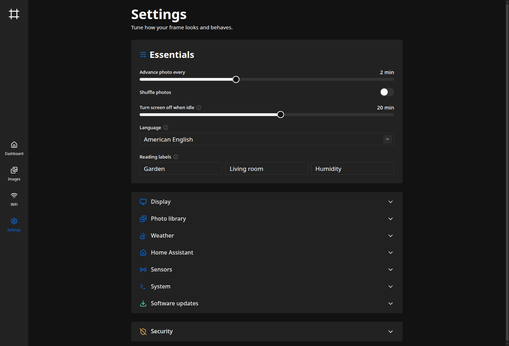

There are two ways to configure the frame, and most of the time you'll only need the first.

## The admin interface

Open the frame's web interface (`http://pictureframe-XXXX.local`) and head to **Settings**.
Nearly everything lives here (the slideshow, the display, the photo library, weather, sensors,
Home Assistant, and updates), grouped into sections you expand as needed.



Edit a value and a save bar appears at the bottom. Most changes apply as soon as you save. A
few need a quick restart of the frame itself (the program, not the whole Pi), which is covered
below. The [User Manual](/manual/dashboard/) covers each section in turn, and the
[configuration reference](/reference/configuration/) documents every setting in detail.

## The configuration files

Behind the interface, configuration lives in two [TOML](https://toml.io) files in the install
directory (by default `~/picture-frame/` for the user you installed as):

- **`config.toml`** is the base configuration. The installer writes it, and re-running the
  installer won't overwrite it. Edit it by hand for low-level settings or to set your own
  starting point.
- **`runtime-overrides.toml`** is where the admin interface saves your changes. At startup the
  frame reads `config.toml`, then layers the overrides on top, so anything you set through the
  interface takes precedence.

Most people only ever use the admin interface and never open either file.

If you do edit `config.toml` by hand, restart the service so the change is picked up:

```sh
sudo systemctl restart kiosk-backend.service
```

:::note
Because overrides win, a hand-edit to `config.toml` won't take effect if the admin interface
has already set that same value (it lives in `runtime-overrides.toml`). Change it from the
interface, or remove it from the overrides file.
:::

## When a restart is needed

Most settings take effect as soon as you save them. A few (changing the display backend, or
switching the photo library between local files and Immich) need a restart. The dashboard has a
**Restart** button for exactly this. It restarts the program in place, without rebooting the Pi.

## Setting the admin password

If you didn't set a password during install, add one from **Settings → Security**. It takes
effect immediately, no restart needed. The same section lets you change or remove it later. The
password is stored only as a salted hash, never in plain text.

You can also set it at install time with `--app-password`, or hash one yourself:

```sh
~/picture-frame/picture-frame -hash-password
```

This prints the hash to drop into `config.toml` under `[auth]` as `password_hash`.

:::note
Secrets you enter in the admin interface (the Immich share password, weather API key, MQTT
password, and update token) are write-only. The interface shows whether one is set, but never
displays it back.
:::
