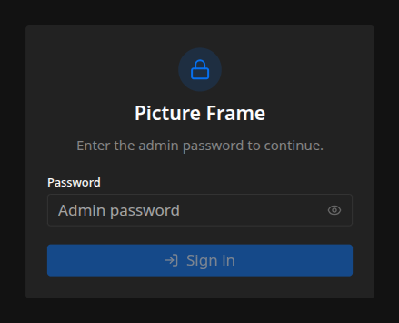

One command installs the frame on a fresh Raspberry Pi and provisions the whole device. Make
sure your Pi meets the [requirements](/getting-started/overview/) first. In short: Raspberry Pi OS Trixie
**Lite**, on the network, reachable over SSH.

## Run the installer

On the Pi (over SSH or at the console):

```sh
curl -fsSL https://github.com/MateEke/picture-frame/releases/latest/download/install.sh | sudo bash
```

That's the whole thing. The installer:

- detects the CPU architecture and downloads the matching release, verifying it with a
  [minisign](https://jedisct1.github.io/minisign/) signature and a SHA-256 checksum
- installs the system packages and sets up the kiosk: the compositor, the browser, the
  background service, the hostname, and the HDMI output
- seeds a `config.toml` with sensible defaults
- optionally configures a Wi-Fi recovery hotspot and an admin password

It's safe to re-run: it re-applies the system setup but never overwrites an existing
`config.toml`.

## What it asks

Unless you pass everything as flags, the installer prompts for three things. Each has a safe
default, so you can press Enter through all of them.

1. **A Wi-Fi recovery hotspot.** If you enable it, the frame raises its own access point when it
   can't reach your network, so you can reconnect it from your phone if you move it or change
   your Wi-Fi, without digging out a keyboard. You choose the network name and an optional
   password.
2. **An admin password.** Protects the web interface. Leave it blank to run unprotected on your
   home network, or set one and you'll sign in on first visit. You can change this any time from
   the admin interface.
3. **Automatic OS security updates.** On by default. It enables Debian's security updates only,
   and never reboots on its own.

When it finishes, it offers to reboot. The HDMI output is pinned during install, so a reboot is
needed to apply it:

```sh
sudo reboot
```

## First look

After the reboot, the frame starts on its own. It has no photos yet, so the screen shows just
the clock and date until you add some.

To add photos and finish setting up, open the admin interface. Browse to your Pi's hostname
from any device on the network. The installer sets a unique hostname derived from the Pi's
Wi-Fi MAC, shown at the end of the install:

```
http://pictureframe-XXXX.local
```

If you set an admin password, you'll be asked to sign in:



From there you can add photos, configure sensors, connect Home Assistant, and adjust how the
frame looks. The [User Manual](/manual/dashboard/) walks through each part, and the
[configuration basics](/getting-started/configuration/) cover where settings live and how they're applied.

:::note[Can't reach the `.local` address?]
`.local` discovery (mDNS) works on most networks but not all. If the hostname doesn't resolve,
use the Pi's IP address instead. Your router's device list will show it, or run `hostname -I`
on the Pi.
:::

## Options

The installer takes flags for unattended or customized setups. A few of the common ones:

| Flag                                               | Purpose                                                                                                                                                     |
| -------------------------------------------------- | ----------------------------------------------------------------------------------------------------------------------------------------------------------- |
| `--display-backend wlopm\|vcgencmd`                | Screen-power backend. `wlopm` (default) is recommended, but `vcgencmd` is a lighter legacy fallback. See [Slideshow & display](/manual/slideshow-display/). |
| `--ssid <name>` / `--ap-password <pw>` / `--no-ap` | Configure or disable the Wi-Fi recovery hotspot.                                                                                                            |
| `--app-password <pw>`                              | Set the admin password non-interactively.                                                                                                                   |
| `--no-unattended-upgrades`                         | Skip enabling automatic OS security updates.                                                                                                                |
| `--version <tag>`                                  | Install a specific release instead of the latest.                                                                                                           |
| `--non-interactive`, `--yes`                       | Never prompt. Use flags and defaults only.                                                                                                                  |
| `--dry-run`                                        | Print every action without making changes.                                                                                                                  |
| `--uninstall`                                      | Reverse an install, leaving `config.toml` and photos in place.                                                                                              |

A fully unattended install looks like:

```sh
curl -fsSL https://github.com/MateEke/picture-frame/releases/latest/download/install.sh \
  | sudo bash -s -- --yes --app-password 'choose-something' --ssid 'Frame-Setup'
```

Run `install.sh --help` for the complete list.
