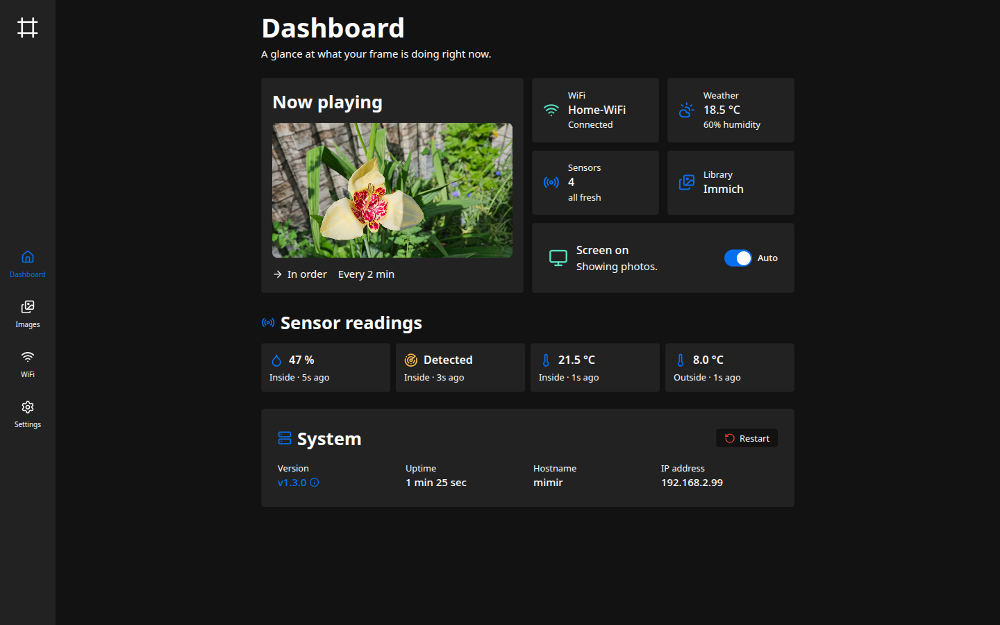
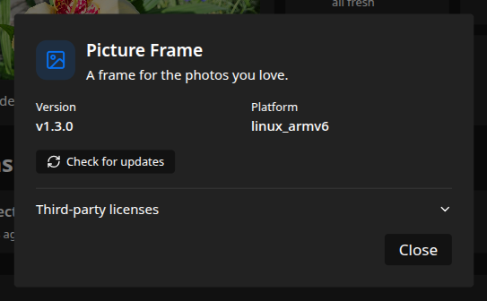
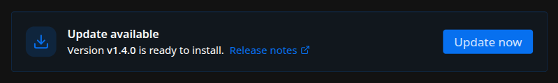

The dashboard is the admin interface's home page. It's a read-mostly overview of what the frame
is doing right now: the current photo, connection and sensor health, the screen's state, and
basic system information. Most of the controls here are shortcuts into the other sections.

## Now playing

Shows the photo currently on the screen, how often photos advance, and whether they play in
order or shuffled. Those last two come from the slideshow settings on
[Slideshow & display](/manual/slideshow-display/). Manage the photos themselves on
[Photos](/manual/photos/).

## Status tiles

A row of tiles summarizes the frame's connections and inputs. Each one links to the section
where you can change it.

- **Wi-Fi.** The current network and connection state. Opens [Wi-Fi](/manual/wifi/).
- **Weather.** The latest reading from OpenWeatherMap, when weather is configured. Set it up
  under [Weather](/manual/weather/).
- **Sensors.** How many sensors are configured and whether their readings are fresh. If any have
  stopped reporting, a count of stale ones shows here. See [Sensors](/manual/sensors/).
- **Library.** Whether photos come from local uploads or Immich, with a warning if the last
  Immich sync failed. Opens [Photos](/manual/photos/).

## Screen

The screen card shows whether the panel is on or off, with a short note on why. A toggle
switches between two modes.

- **Auto.** The frame manages the screen. With a motion sensor it blanks after a stretch of no
  motion and wakes when motion returns. Without one, the screen stays on.
- **Off.** Forces the screen off and ignores motion until you switch back to Auto.

The idle timeout and motion sensing behind this are covered on
[Slideshow & display](/manual/slideshow-display/) and [Sensors](/manual/sensors/).

## Live sensor readings

Below the tiles, the dashboard lists each current reading (temperature, humidity, motion) with
the sensor's role and how long ago it last reported. A reading that hasn't updated within its
freshness window is marked stale. Configure sensors on [Sensors](/manual/sensors/).

## System

The system card reports the device's basics.

- **Version.** The running version. Click it to open the About dialog, which shows the platform,
  offers a **Check for updates** button, and lists the third-party license notices.
- **Uptime**, **hostname**, and **IP address** of the device.
- **Restart.** Restarts the program in place, without rebooting the Pi. Use it to apply the few
  settings that ask for a restart (see [Configuration basics](/getting-started/configuration/)).

## Software updates

The frame checks for new releases on its own. To scan right away, open the About dialog (click
the version in the System card) and choose **Check for updates**.

When a release is ready, an **Update available** panel appears near the top of the dashboard
with the version, a link to the release notes, and an **Update now** button.

Installing it downloads and verifies the release, then restarts into the new version, so the
frame is briefly unreachable. If the new version fails to start, the frame rolls back on its own
and a notice here says so.

This is where updates are installed by hand. Automatic updates and the release source are
configured separately on [Software updates](/manual/updates/).
