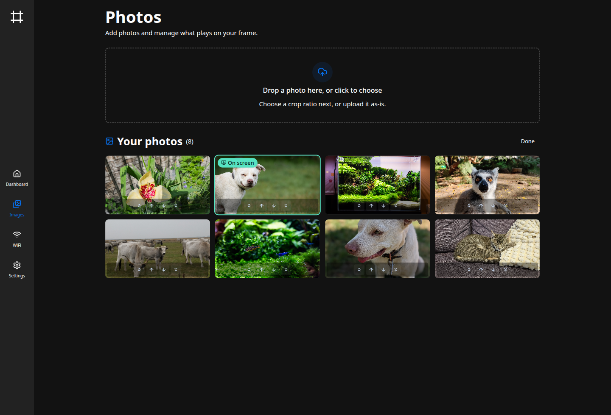

The **Images** page is where the frame's photos live. What it shows depends on the photo
library backend: local files you upload, or a synced [Immich](https://immich.app) album. You
pick the backend in **Settings → Photo library** (see [Configuration basics](/getting-started/configuration/)).

## Local photos

With the default **local files** backend, you upload and manage photos here directly.

### Uploading

Drag image files onto the upload area, or click it to pick them. Each one opens a quick cropper.

Choose an aspect ratio for the screen (16:9 by default, or 9:16, 4:3, and 1:1), then drag and
zoom to frame the shot. The cropper remembers your last ratio. **Upload** stores the cropped
result, so large camera files shrink to what the screen shows.

To keep the whole photo, choose **Upload without cropping**: it saves the image uncropped,
scaled down to fit. Either way the frame stores a JPEG.

### Managing the grid

Uploaded photos appear in the grid below. The one currently on the frame is marked with an
**On screen** badge. Hover a photo for a delete button, or click it to open a larger preview.

To remove several at once, use **Select**, tick the photos you want gone, and **Delete** them
in one step. Both single and bulk deletes ask for confirmation first.

### Arranging the order

**Arrange** sets the order photos play in. Click it, then reorder the grid: drag a photo to a new
spot, or use the buttons on each one to move it up, down, to the start, or to the end. **Done**
saves the arrangement.

The order you set is what plays when **Shuffle photos** is off (see
[Slideshow & display](/manual/slideshow-display/#the-photo-rotation)), and **Done** restarts the
frame on it right away. With shuffle on, a banner notes the order won't affect playback until you
turn shuffle off. New uploads join the end. Arranging is for local photos; an Immich album keeps
its own order.

To choose which two photos appear side by side under
[split-screen pairing](/manual/slideshow-display/#split-screen-pairing), put them next to each other.

## Using Immich instead

To pull photos from [Immich](https://immich.app) rather than uploading them, switch the backend
to **immich** in **Settings → Photo library** and give it a shared-album link:

1. In Immich, create a shared link for the album you want on the frame. A password is optional.
2. Paste the share URL (and password, if any) into the Photo library settings.
3. Set how often the frame reconciles with the album, then save and restart.

The frame then keeps a local copy of the album in sync, and the Images page becomes read-only:

The status card shows when the album last synced and how many photos it holds. **Sync now**
reconciles immediately instead of waiting for the next interval, **Open album** jumps to the
album in Immich, and a failed sync is flagged here with the reason.

:::note
On Immich 2.6.0 and newer, the frame exchanges the share password for a session token, so it
stays out of request URLs and server logs. Older servers fall back to sending it as a query
parameter on every request. Either way, keep your Immich server behind TLS and avoid reusing a
high-value password for the link.
:::

## Where photos live

Local uploads and the synced Immich cache both sit under the images directory
(`slideshow.images_dir`, default `images`). The backend and Immich link are stored under
`[library]`. Every key is documented in the [configuration reference](/reference/configuration/).
