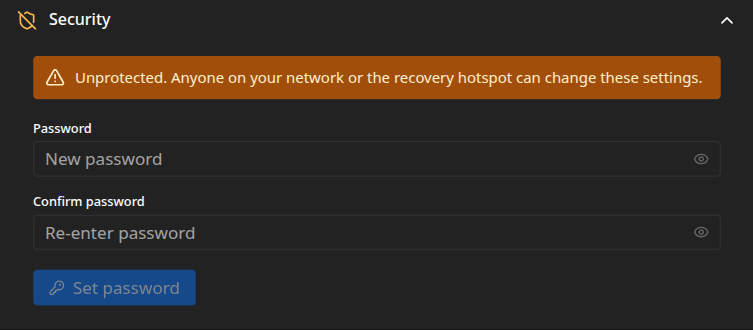

The admin interface can run open or behind a password. Set one if the frame shares a network with
people you would rather not let reconfigure it, or if the recovery hotspot might be left open,
since anyone who can reach the frame can otherwise change its settings, photos, and Wi-Fi. Manage
it under **Settings → Security**. The frame's own slideshow is never behind a password.

## What a password protects

With a password set, the admin interface asks you to sign in on the first visit and keeps you
signed in afterward. It covers the whole admin interface and its API: settings, photos, Wi-Fi,
and updates. The slideshow on the frame keeps running untouched, since the display is served over
the device's own loopback. You can also set the password during
[install](/getting-started/install/).

:::caution[A password is not encryption]
The frame serves its admin interface over plain HTTP, with no certificate. A password keeps a
curious housemate from uploading something or locking you out, but it is not real protection
against someone with basic networking know-how: because the connection is unencrypted, anyone who
can watch traffic on your network can capture the password or the session cookie and get in.
Treat the password as a deterrent. For genuine security, secure the network path, as below.
:::

## Setting a password

Until you set one, the card shows an **Unprotected** warning. Enter a password, confirm it, and
choose **Set password** (up to 72 characters). It takes effect at once, and you sign in on the
next visit.

## Changing or removing it

With a password in place, the card asks for the current password to **Change password**, or to
**Disable protection**, which reopens the admin interface to anyone in range. Both need the
current password, and changing it signs out other sessions.

If you forget the password, clear the saved one on the device over SSH, by removing it from the
configuration, then restart. See [Configuration basics](/getting-started/configuration/) for
where settings live.

## Hardening the device

For anything past casual protection, secure the network rather than leaning on the password.
Since the frame usually lives on Wi-Fi, where other clients can often see each other's traffic,
these matter more than they would on a wired desk:

- **Put it behind a reverse proxy with TLS.** Run a proxy such as Caddy, nginx, or Traefik in
  front of the frame so you reach the admin interface over HTTPS. That encrypts the password and
  the session cookie in transit. A proxy on your own network can use a certificate from a domain
  you own or from an internal certificate authority.
- **Segment the Wi-Fi.** Keep the frame on a separate or guest network, and turn on your access
  point's client isolation so other devices on the Wi-Fi cannot reach it at all. Isolation is
  what closes the sniffing gap that plain HTTP leaves open.
- **Limit who can reach it.** A firewall rule that allows the admin interface only from the
  device you manage it with shuts out everyone else on the network.
- **Never expose it to the internet.** Keep the frame on your own network. To reach it from
  away, use a VPN such as WireGuard or Tailscale rather than forwarding a port.
