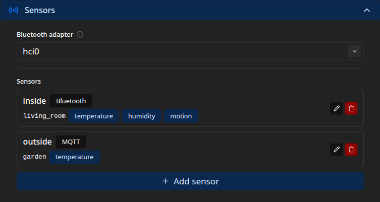

Sensors feed the live readings on the frame: the inside and outside temperature, the humidity,
and motion. Motion is also what lets the screen sleep when a room empties and wake when you
return, and every reading is published to [Home Assistant](/manual/home-assistant/) when the
bridge is on. Manage them under **Settings → Sensors**. A fresh frame has none.

## Roles and readings

Each sensor has a **role** and one or more **kinds**. The role groups its readings by place,
usually `inside` or `outside`. The kind is what it measures: `temperature`, `humidity`, or
`motion`.

On the frame, an inside sensor's temperature shows as the inside reading and an outside
sensor's as the outside reading. See [the kiosk display](/manual/kiosk/). An outside
temperature sensor takes priority over [weather](/manual/weather/), which fills in only when no
sensor reading is current. A motion reading drives the idle screen-off described on
[Slideshow & display](/manual/slideshow-display/).

Each role-and-kind pair is unique. Two sensors cannot both supply the inside temperature, for
example. The admin interface rejects the clash.

## Sensor types

A sensor draws from one of three sources.

**Bluetooth (BLE)** connects to a nearby device by its MAC address and reads its GATT
characteristics. It listens for notifications where the device offers them, the low-latency path
that suits motion, and polls on a timer as a fallback. For each characteristic you map its UUID
to a reading kind and a decoder that turns the raw bytes into a number. This uses the Pi's
Bluetooth. Pick the adapter (usually `hci0`) at the top of the card, and set the device's
address type, public or random, when you add it. Public is a manufacturer-assigned address.
Random is one the device generates itself, which is what many small sensors use. A BLE scanner
shows which a device uses, so you need not guess.

The frame connects to the device to read it, so a sensor that only broadcasts its values in
advertisement packets, without accepting a connection, is not supported here. Bring those in
over MQTT instead: a gateway that decodes them, such as Home Assistant's Bluetooth integration
or an ESPHome proxy, can republish the value for an MQTT sensor to read.

:::tip[Finding a device's Bluetooth details]
A phone BLE explorer such as [nRF Connect](https://www.nordicsemi.com/Products/Development-tools/nRF-Connect-for-mobile)
(Nordic Semiconductor) or LightBlue shows a device's MAC address and its type, its characteristic
UUIDs, and the raw bytes each one returns. That is everything you need to fill in a Bluetooth
sensor and choose its decoders.
:::

**MQTT** turns a topic you already publish into a reading, whether from Zigbee2MQTT, an Ecowitt
gateway, Home Assistant, or anything else on your broker. It needs the MQTT broker set up first
(see [Home Assistant](/manual/home-assistant/)). You choose a parser for the payload, and for a
topic that carries several values in one JSON message, you point a field path at the one you
want. To read Home Assistant's own entities, enable its
[MQTT Statestream](https://www.home-assistant.io/integrations/mqtt_statestream/) integration so
they appear on the broker.

**Mock** emits made-up readings on a timer, with no hardware. It is handy for trying the frame
out before real sensors arrive.

:::caution[Don't subscribe to the frame's own topics]
If the Home Assistant bridge is on, an MQTT sensor must not read a topic the frame itself
publishes. That would loop the frame's own readings back into the display.
:::

## Decoders

A decoder turns a raw value into the number shown on the frame. The same set is available to
both sensor types. Bluetooth calls it the decoder, MQTT calls it the parser.

- `int16le_div100`, a little-endian signed 16-bit integer divided by 100, so `2345` reads as
  `23.45`.
- `uint16be_div10`, a big-endian unsigned 16-bit integer divided by 10, so `485` reads as
  `48.5`.
- `bool_nonzero`, any non-zero byte becomes 1, for motion and other on-or-off readings.
- `raw_float` and `raw_int`, for text that already holds a number, such as `23.4` or `42`.
- `onoff_to_bool`, which reads `ON`, `on`, `true`, or `1` as 1 and anything else as 0.

The first three suit Bluetooth's binary characteristics. The last three suit text MQTT payloads.
If a device's format matches none of them, republish it as a plain number through Home Assistant
or another gateway, then read that with an MQTT sensor.

## Adding a sensor

Click **Add sensor**, then give it:

- an **ID**, a unique name for the sensor;
- a **Role**, such as `inside` or `outside`;
- a **Type**, Bluetooth, MQTT, or Mock, which reveals the fields for that source.

Save with **Add**. Existing sensors appear in a list, each showing its role, type, and reading
kinds. Edit or delete one from there.

:::note[Restart required]
Adding, editing, or removing a sensor, and changing the Bluetooth adapter, take effect after
the frame restarts.
:::

## When a reading does not appear

A sensor that cannot start, because the Bluetooth adapter is missing, a dongle is unplugged, or
the broker is unreachable, is skipped rather than allowed to take the frame down, so the photos
keep running. If a reading is missing, check the device, the role and kind, and, for Bluetooth,
that the adapter is powered. The installer unblocks the Pi's Bluetooth, and a BLE reading
appears once the device connects.

Every sensor field is listed in the [configuration reference](/reference/configuration/).
