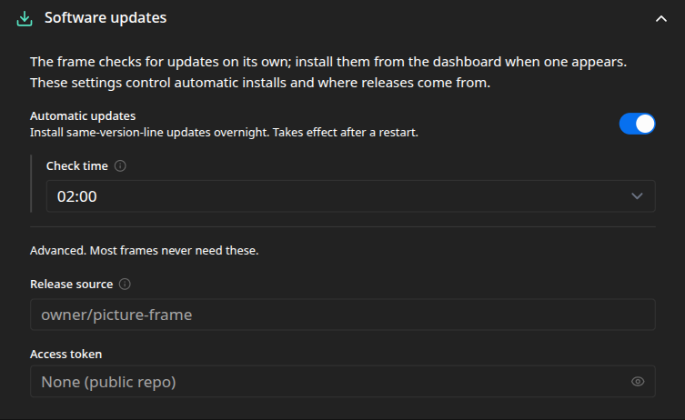

The frame keeps itself up to date. It checks for new releases on its own, can install them
overnight, and rolls a failed update back without help. You can also install one by hand from the
[Dashboard](/manual/dashboard/). The automatic behavior and the release source are set under
**Settings → Software updates**.

## How updating works

The frame checks for a newer release at startup and once a day, whether or not automatic updates
are on. When one is available, a badge appears on the [Dashboard](/manual/dashboard/).

Installing an update downloads it, verifies its signature and checksum, swaps it in, and restarts
the frame on the new version.

Automatic installs are limited to the **same version line**. Releases follow semantic
versioning, written `major.minor.patch` (for example `1.4.2`). A new **minor or patch**, like
`1.4.0` or `1.3.2`, only fixes or adds things and keeps working with your existing setup, so the
frame installs it on its own. A new **major**, like `2.0.0`, is the release that is allowed to
change behavior or configuration in ways that could need your attention, so the frame surfaces it
but waits for you to install it by hand, once you have read what changed. That way an unattended
overnight update can never reconfigure the frame out from under you.

## Installing an update

When a release is available, the Dashboard shows an **Update available** panel. Install it from
there. The About dialog also has a **Check for updates** button to look right away. Both are
covered on the [Dashboard](/manual/dashboard/) page.

## Automatic updates

Turn **Automatic updates** on to install same-line updates overnight, at the **Check time** in
the frame's local hour. It is on by default, at 02:00.

:::note[Restart required]
The automatic-update toggle and check time take effect after the frame restarts.
:::

## If an update fails

Safety is built in. The frame checks that a new version comes up after it restarts. If it does
not, the frame restores the previous version on its own, so an update cannot leave it stuck. A
version that rolled back is not retried automatically, though you can still install it by hand
once the cause is sorted out.

## Release source

Most frames never need this. It is meant for forks and private builds.

- **Release source** is the GitHub repository, as `owner/name`, to fetch releases from. Leave it
  blank to track the official releases.
- **Access token** authenticates against a private release source.

Every setting on this page maps to a key in the [configuration reference](/reference/configuration/).
