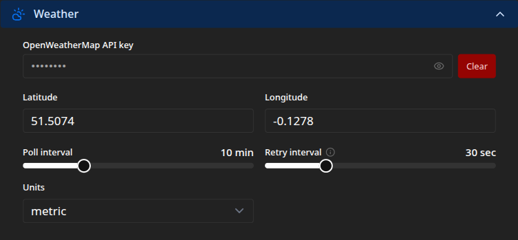

The frame can show the current weather for your location beside the clock: the outdoor
temperature and an icon for the sky. It reads from [OpenWeatherMap](https://openweathermap.org),
so it needs a free API key. Without one, weather stays off and the frame leaves it out.
Set it up under **Settings → Weather**. These are current conditions, not a forecast.

## What it shows

On the frame, weather is the **outside** reading: the current temperature and an icon for the
sky, such as clear, cloudy, or rain. [The kiosk display](/manual/kiosk/) shows where it sits.

If you also have an outside temperature [sensor](/manual/sensors/), its reading takes priority,
and weather fills in only when no sensor reading is current. The sky icon always comes from
weather.

## Setting it up

- **OpenWeatherMap API key.** Create a free account at
  [openweathermap.org](https://openweathermap.org), generate a key, and paste it here. Leaving
  it empty turns weather off.
- **Latitude** and **Longitude.** Your location as decimal coordinates, for example `51.5074`
  and `-0.1278`. To find yours, look them up on [latlong.net](https://www.latlong.net) or
  right-click your spot in a maps app.
- **Units.** `metric` for degrees Celsius, `imperial` for Fahrenheit, or `standard` for Kelvin.
  This sets how the temperature reads on the frame.

:::note[Restart required]
The API key, location, and units take effect after the frame restarts.
:::

## How often it updates

- **Poll interval.** How often the frame fetches fresh conditions. The default is ten minutes,
  which sits well within the free tier's limits.
- **Retry interval.** The first delay after a failed fetch. It backs off up to the poll
  interval, so a brief outage does not hammer the service.

Both apply the moment you save.

Every setting on this page maps to a key in the [configuration reference](/reference/configuration/).
