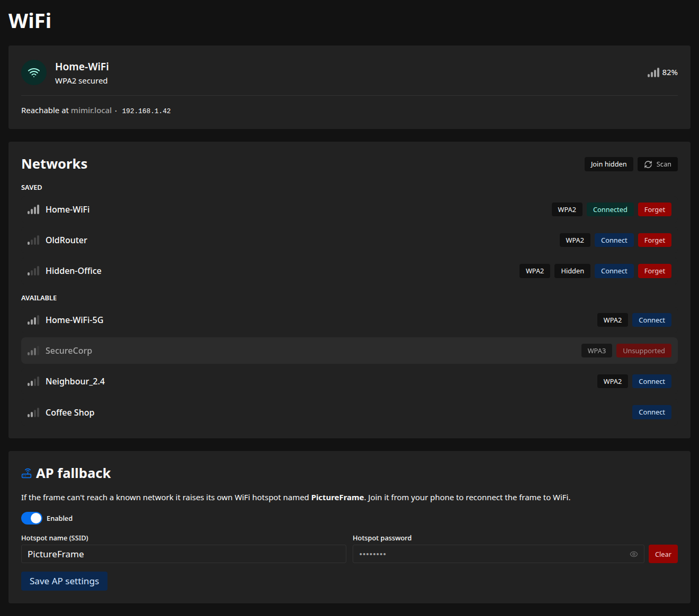

The Wi-Fi page shows the frame's current connection, scans for networks nearby, and connects to
or forgets them. It also runs a hotspot fallback that rescues a frame which can no longer reach a
known network, the situation you hit after moving it or changing your Wi-Fi. Find it under
**Wi-Fi** in the admin interface.

## Current connection

The status card shows whether the frame is connected and to which network, or whether it is
running its own hotspot, along with its hostname and address.

## Joining a network

Scan to list the networks in range. A saved network or an open one connects in a single click.
A secured network you have not used before asks for its password first.

A banner follows the attempt, from connecting through to success or the error that stopped it.
When the frame moves to a different network its address can change, so you reach it again at its
hostname, such as `http://pictureframe-XXXX.local`.

A hidden network does not show up in a scan. Use **Join hidden** above the network list, type its
exact name and password, and the same banner follows the attempt. Leave the password empty for an
open network.

:::note[WPA3 networks]
A WPA3-only network shows as **Unsupported** and cannot be joined: the onboard Wi-Fi on the
supported Pis does not handle WPA3 reliably ([raspberrypi/linux #4718](https://github.com/raspberrypi/linux/issues/4718)).
A network advertising both WPA2 and WPA3 usually connects fine, over WPA2. If one will not, set
that network to WPA2.
:::

## Forgetting a network

Forgetting a saved network stops the frame from using it. If you forget the network it is
currently on, the frame fast-tracks to another saved network in range, or raises its hotspot if
there is none. The confirmation spells out which will happen before you commit.

A hidden network you have joined still appears in the **Saved** list, tagged **Hidden**, even
though it never shows up in a scan, so you forget it the same way.

## The hotspot fallback

This is the recovery path for a frame that has lost its network. After a few minutes with no
known network in reach, the frame raises its own Wi-Fi hotspot with a captive portal. Join it
from your phone, and the admin interface opens on its own so you can point the frame at the new
network, with no keyboard or SSH. While the hotspot is up the frame keeps scanning, and it
rejoins a known network the moment one returns.

On this card you can:

- turn the fallback on or off;
- set the **hotspot name**, `PictureFrame` by default;
- set an optional **hotspot password**, or leave it empty for an open hotspot.

These apply immediately. The [installer](/getting-started/install/) can set the hotspot up at
install time as well.

The delay before the hotspot appears and how often the frame rescans while it is up are
config-file settings (`ap_timeout_minutes` and `scan_interval_minutes`), listed in the
[configuration reference](/reference/configuration/).
